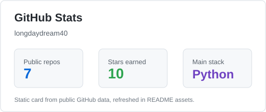
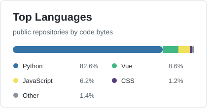

  

  
  
  

  
  
  

## About Me / 关于我

Hi, I am Sanli. 目前在 Nanjing Forestry University 学习，也在慢慢把日常里遇到的麻烦，整理成一些可复用的小工具。

我主要写 Python，也会做 WebUI、automation scripts 和一些 campus-focused products。比起很宏大的东西，我更喜欢那些安静但有用的项目：能少点重复操作，能让流程顺一点，也能让学习和生活轻一点。

| Focus | Things I care about |
| --- | --- |
| Python automation | 把重复的步骤写成 scripts，让事情更快结束 |
| WebUI products | 给原本只在 terminal 里的工具，加一个更顺手的界面 |
| Campus utilities | 面向课程、考试、文档和校园日常的小软件 |
| Learning direction | Automation, developer tools, full-stack workflow，还有更好的产品感 |

<!-- Personal info to customize later:
- Display name: Sanli
- Current learning focus
- More social links
-->

## Tech Stack / 技术栈

  

  
  
  
  

## Featured Work / 一些作品

| Project | What it does | Stack |
| --- | --- | --- |
| [chaoxing-webui](https://github.com/longdaydream40/chaoxing-webui) | 基于 chaoxing-tui 做的 WebUI，支持 one-click startup 和 multi-user server deployment | Python, WebUI |
| [NJFU-ExamTool](https://github.com/longdaydream40/NJFU-ExamTool) | 一个面向思政课程题目流程的 practical tool，尽量把机械步骤交给程序 | Python |
| [NJFU-university-student-handbook](https://github.com/longdaydream40/NJFU-university-student-handbook) | 为 NJFU students 整理的 campus handbook，方便查阅和沉淀信息 | Docs |
| [pixel-motion](https://github.com/longdaydream40/pixel-motion) | 用来处理图片背景和边缘瑕疵的小工具，remove cyan backgrounds and edge halos | Python |

## GitHub Snapshot / 代码足迹

  
  

  <picture>
    <source media="(prefers-color-scheme: dark)" srcset="https://raw.githubusercontent.com/longdaydream40/longdaydream40/output/github-contribution-grid-snake-dark.svg" />
    <source media="(prefers-color-scheme: light)" srcset="https://raw.githubusercontent.com/longdaydream40/longdaydream40/output/github-contribution-grid-snake.svg" />
    
  </picture>

## Connect / 联系我

  
  
  
  

