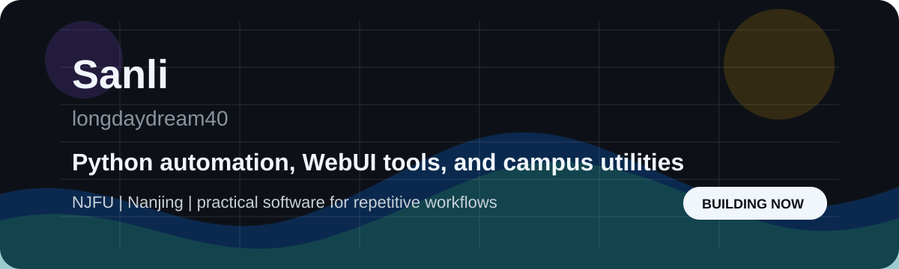

  

  
  
  

  
  
  

## About Me

I am Sanli, a student at Nanjing Forestry University. I build Python projects, WebUI tools, automation utilities, and small campus-focused products that make repeated work easier to finish.

| Focus | What I Like Building |
| --- | --- |
| Python automation | Scripts, task runners, and practical workflow tools |
| WebUI products | Simple interfaces for tools that should not stay in the terminal |
| Campus utilities | Small software for learning, exams, documents, and daily school workflows |
| Learning direction | Automation, developer tools, and full-stack workflows |

<!-- Personal info to customize later:
- Display name: Sanli
- Current learning focus
- More social links
-->

## Tech Stack

  

  
  
  
  

## Featured Work

| Project | What It Does | Stack |
| --- | --- | --- |
| [chaoxing-webui](https://github.com/longdaydream40/chaoxing-webui) | WebUI based on chaoxing-tui, with one-click startup and multi-user server deployment | Python, WebUI |
| [NJFU-ExamTool](https://github.com/longdaydream40/NJFU-ExamTool) | A practical tool for completing ideological and political course quiz tasks | Python |
| [NJFU-university-student-handbook](https://github.com/longdaydream40/NJFU-university-student-handbook) | A campus handbook project for NJFU students | Docs |
| [pixel-motion](https://github.com/longdaydream40/pixel-motion) | Image cleanup utility for removing cyan backgrounds and edge halos | Python |

## GitHub Snapshot

  
  

  

## Connect

  
  
  
  

